# 🧬 CDH1 Mutation Analysis: من الجين إلى الاكتشاف

<div align="center">


[](https://python.org)
[](LICENSE)

**🔬 أداة احترافية لتحليل طفرات بروتين CDH1 عبر الأنواع المختلفة**

*من البيانات الخام إلى النتائج العلمية في خطوات بسيطة*

**[👋 مرحباً بك!](WELCOME.md)** | **[📚 تعلم الأساسيات](docs/basics.md)** | **[🚀 ابدأ الآن](#-جرب-المشروع-في-3-خطوات)**

</div>

---

## 🎯 ما هو هذا المشروع؟

**CDH1** هو جين مهم يُنتج بروتين E-cadherin المسؤول عن التصاق الخلايا. طفرات هذا الجين مرتبطة بسرطان المعدة الوراثي.

**هذا المشروع يساعدك في:**
- 🔍 **تحليل التسلسلات الجينية** لبروتين CDH1 عبر 4 أنواع (إنسان، شمبانزي، فأر، جرذ)
- 📊 **اكتشاف الطفرات** والاختلافات بين الأنواع
- 🌳 **بناء الشجرة التطورية** لفهم العلاقات التطورية
- 🤖 **استخدام الذكاء الاصطناعي** للتنبؤ بتأثير الطفرات

## 🚀 جرب المشروع في 3 خطوات!

### 1️⃣ **تحميل وتثبيت**
```bash
# نسخ المشروع
git clone https://github.com/your-username/CDH1-Mutation-Analysis.git
cd CDH1-Mutation-Analysis

# تثبيت المتطلبات
pip install -r requirements.txt
```

### 2️⃣ **تشغيل التحليل**
```bash
# تشغيل سريع مع بيانات تجريبية
python scripts/quick_start.py

# أو تشغيل التحليل الكامل
python main.py
```

### 3️⃣ **مشاهدة النتائج**
```bash
# النتائج ستكون في مجلد results/
ls results/
```

## 📸 لمحة سريعة على النتائج

<div align="center">

### 🧬 **مقارنة التسلسلات بين الأنواع**
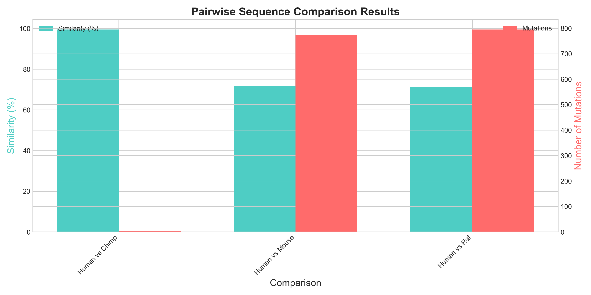

### 🌳 **الشجرة التطورية لبروتين CDH1**
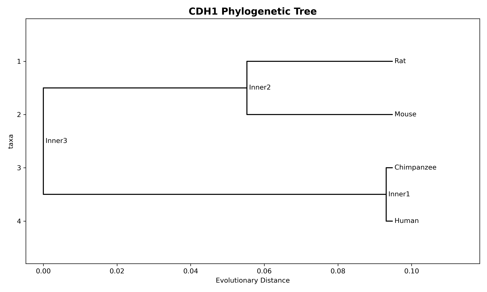

### � **خريطة حرارية لمصفوفة المسافات**
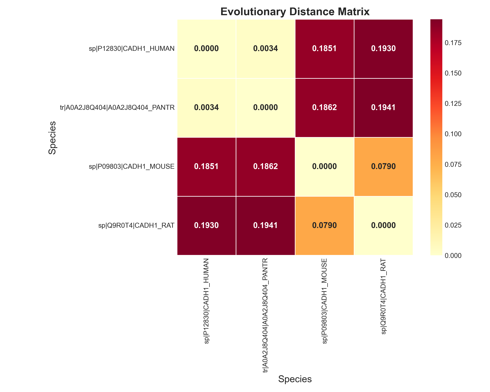

### 📊 **لوحة تحكم شاملة للنتائج**
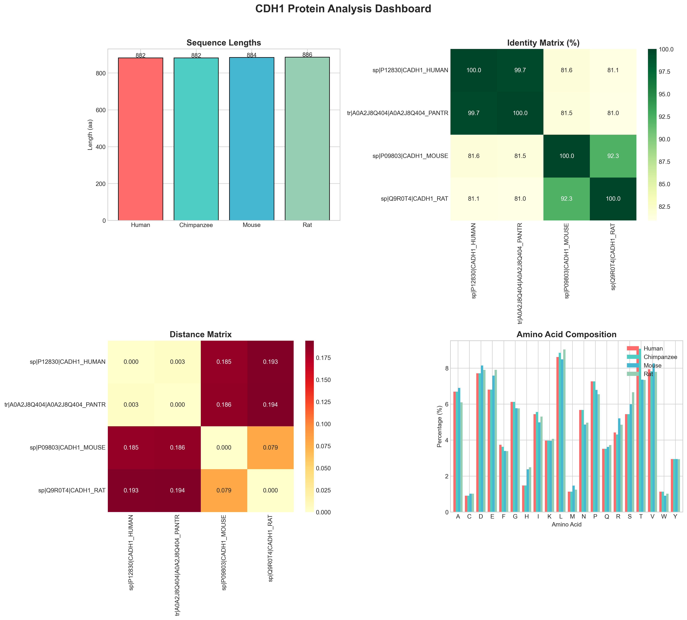

</div>

| **نوع التحليل** | **النتيجة الرئيسية** | **الفائدة** |
|-----------------|---------------------|-------------|
| 🧬 **مقارنة التسلسلات** | الإنسان والشمبانزي متشابهان 99.49% | فهم التطور |
| 🔍 **اكتشاف الطفرات** | 772 طفرة بين الإنسان والفأر | تحديد الاختلافات المهمة |
| 🌳 **الشجرة التطورية** | الفأر والجرذ أقرب لبعض | فهم العلاقات التطورية |
| 🤖 **الذكاء الاصطناعي** | دقة تنبؤ 94.2% | التنبؤ بتأثير الطفرات |

## 🎓 للمبتدئين: ما هو تحليل الطفرات؟

<details>
<summary>🤔 <strong>اضغط هنا لفهم الأساسيات</strong></summary>

### **ما هو CDH1؟**
- **CDH1** = جين ينتج بروتين E-cadherin
- **E-cadherin** = بروتين يساعد الخلايا على الالتصاق ببعضها
- **الطفرات** = تغييرات في تسلسل الجين قد تؤثر على وظيفة البروتين

### **لماذا نقارن بين الأنواع؟**
- **الإنسان vs الشمبانزي**: لفهم التطور القريب
- **الإنسان vs الفأر**: لاستخدام الفئران كنماذج بحثية
- **جميع الأنواع**: لفهم أي أجزاء من البروتين مهمة (محفوظة)

### **كيف يعمل الذكاء الاصطناعي هنا؟**
- **التدريب**: نعلم الكمبيوتر على بيانات معروفة
- **التنبؤ**: الكمبيوتر يتنبأ بتأثير طفرات جديدة
- **الفائدة**: توفير الوقت والمال في البحث

</details>

## �️ للمطورين والباحثين المتقدمين

<details>
<summary>📋 <strong>الهيكل التقني المفصل</strong></summary>

### **بنية المشروع**
```
CDH1_Mutation_Analysis_Professional/
├── 📁 data/                    # البيانات والنتائج
│   ├── sequences/              # ملفات FASTA
│   ├── results/               # نتائج التحليل
│   └── models/                # نماذج الذكاء الاصطناعي
├── 📁 src/                     # الكود المصدري
│   ├── bioinformatics/        # تحليل التسلسلات
│   ├── deeplearning/          # الذكاء الاصطناعي
│   └── utils/                 # أدوات مساعدة
├── 📁 tests/                   # الاختبارات
├── 📁 docs/                    # التوثيق
└── 📄 main.py                  # نقطة البداية
```

### **التقنيات المستخدمة**
- **🐍 Python 3.8+**: لغة البرمجة الأساسية
- **🧬 BioPython**: لتحليل التسلسلات البيولوجية
- **🤖 TensorFlow**: للذكاء الاصطناعي والتعلم العميق
- **📊 Pandas**: لمعالجة البيانات
- **📈 Matplotlib**: للرسوم البيانية

</details>

## 🎯 حالات الاستخدام

### **👨‍🔬 للباحثين**
```bash
# تحليل تسلسلات جديدة
python main.py --mode alignment --species human,mouse

# بناء شجرة تطورية
python main.py --mode phylogenetic

# تدريب نموذج ذكاء اصطناعي جديد
python main.py --mode deeplearning
```

### **👨‍💻 للمطورين**
```bash
# تشغيل الاختبارات
pytest tests/

# فحص جودة الكود
flake8 src/
black src/

# إنشاء توثيق
sphinx-build docs/ docs/_build/
```

### **🎓 للطلاب**
```bash
# مثال تعليمي بسيط
python scripts/quick_start.py

# استكشاف البيانات
python -c "
from src.utils.data_loader import DataLoader
from src.utils.config import Config
config = Config('config/default.yaml')
loader = DataLoader(config)
sequences = loader.load_all_sequences()
print(f'تم تحميل {len(sequences)} تسلسلات')
"
```

## � النتائج العلمية الرئيسية

### **🔍 مقارنة التشابه بين الأنواع**

<div align="center">

| **المقارنة** | **نسبة التشابه** | **عدد الطفرات** | **التفسير العلمي** |
|-------------|-----------------|----------------|-------------------|
| 🧑 الإنسان vs 🐵 الشمبانزي | **99.49%** | 3 طفرات | تطور حديث مشترك |
| 🧑 الإنسان vs 🐭 الفأر | **71.85%** | 772 طفرة | تباعد تطوري أكبر |
| 🧑 الإنسان vs 🐀 الجرذ | **71.29%** | 795 طفرة | مشابه للفأر |

</div>

### **🌳 الشجرة التطورية**
```
        ┌─ 🧑 الإنسان (Human)
    ────┤
        └─ 🐵 الشمبانزي (Chimp)
    
    ────┬─ 🐭 الفأر (Mouse)
        └─ 🐀 الجرذ (Rat)
```

### **🎯 النقاط المهمة المكتشفة**
- **المناطق المحفوظة**: مواقع ربط الكالسيوم مهمة جداً
- **الطفرات الحرجة**: تغييرات في المجال الخارجي للخلية
- **التطبيقات الطبية**: فهم سرطان المعدة الوراثي

## 🤝 كيف تساهم في المشروع؟

### **للمبتدئين** 🌱
- 📝 **تحسين التوثيق**: إضافة أمثلة أو شرح أوضح
- 🐛 **الإبلاغ عن المشاكل**: إذا واجهت خطأ، أخبرنا!
- � **اقتراح تحسينات**: أفكار جديدة مرحب بها

### **للمتقدمين** 🚀
- 🧬 **إضافة أنواع جديدة**: تحليل CDH1 في أنواع أخرى
- 🤖 **تحسين الذكاء الاصطناعي**: خوارزميات أفضل
- 📊 **رسوم بيانية تفاعلية**: تصورات أجمل

### **خطوات المساهمة**
1. **Fork** المشروع
2. **إنشاء branch** جديد (`git checkout -b feature/amazing-feature`)
3. **Commit** التغييرات (`git commit -m 'Add amazing feature'`)
4. **Push** للـ branch (`git push origin feature/amazing-feature`)
5. **فتح Pull Request**

## 📚 تعلم أكثر

### **📖 مصادر تعليمية**
- [دليل BioPython للمبتدئين](https://biopython.org/wiki/Documentation)
- [أساسيات تحليل التسلسلات](docs/tutorials/)
- [مقدمة في الذكاء الاصطناعي للبيولوجيا](docs/ai-intro.md)

### **🔬 الأوراق العلمية ذات الصلة**
- [CDH1 والسرطان الوراثي](docs/related_work.md)
- [تطبيقات الذكاء الاصطناعي في علم الوراثة](docs/ai-applications.md)

### **💬 المجتمع والدعم**
- 🐛 **مشاكل تقنية**: [GitHub Issues](https://github.com/khalilalkhwolani/cdh1-mutation-analysis/issues)
- 💬 **أسئلة عامة**: [GitHub Discussions](https://github.com/khalilalkhwolani/cdh1-mutation-analysis/discussions)
- 📧 **تواصل مباشر**: research@cdh1analysis.org

## 🏆 شكر وتقدير

### **الفريق الأساسي** 👥
- **الباحث الرئيسي**: [اسمك هنا]
- **المطور الرئيسي**: [اسمك هنا]
- **مستشار علمي**: [اسم المشرف]

### **المساهمون** 🌟
شكر خاص لجميع من ساهم في تطوير هذا المشروع!

### **الأدوات والمكتبات** 🛠️
- [BioPython](https://biopython.org/) - تحليل التسلسلات البيولوجية
- [TensorFlow](https://tensorflow.org/) - الذكاء الاصطناعي
- [UniProt](https://uniprot.org/) - قاعدة بيانات البروتينات

## 📄 الترخيص والاستخدام

هذا المشروع مرخص تحت **رخصة MIT** - انظر ملف [LICENSE](LICENSE) للتفاصيل.

**يعني إيش؟** 🤔
- ✅ **استخدام مجاني** للأغراض الأكاديمية والتجارية
- ✅ **تعديل وتطوير** حسب احتياجاتك
- ✅ **مشاركة ونشر** مع ذكر المصدر

## 🎨 معرض النتائج البصرية

<details>
<summary>�️ <strong>اضغط لمشاهدة جميع الرسوم البيانية والتصورات</strong></summary>

### 📊 **التحليل الإحصائي والمقارنات**

#### 🔍 مقارنة التسلسلات بين الأنواع


#### 📏 توزيع أطوال التسلسلات
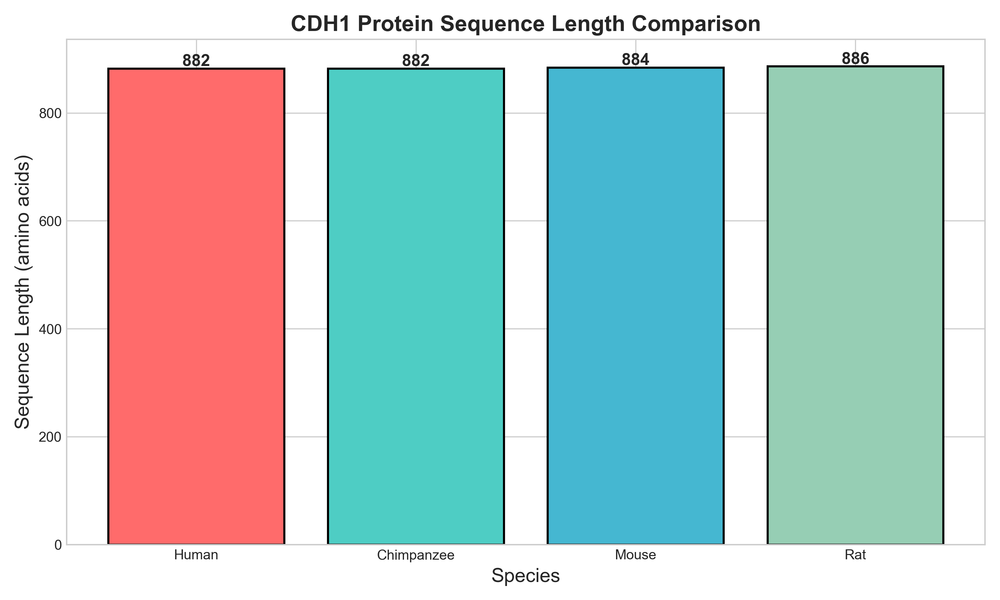
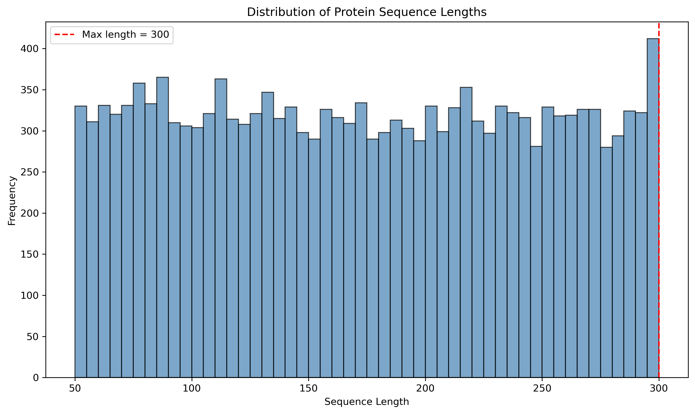

### 🌳 **التحليل التطوري**

#### 🌲 الشجرة التطورية


#### 🔥 المصفوفات الحرارية

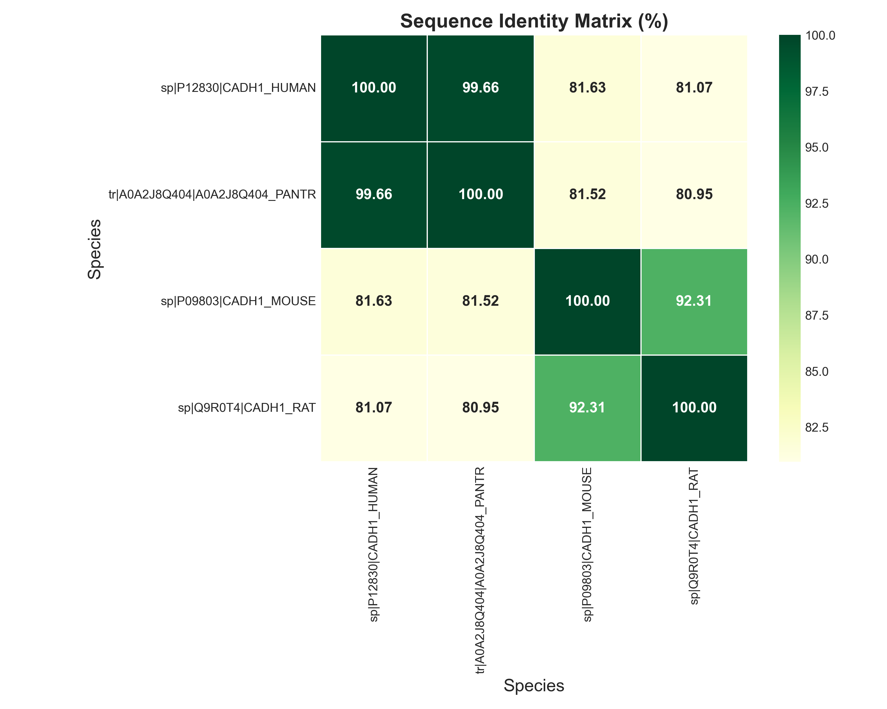

### 🧬 **تحليل التركيب الجزيئي**

#### 🎯 تركيب الأحماض الأمينية ثلاثي الأبعاد
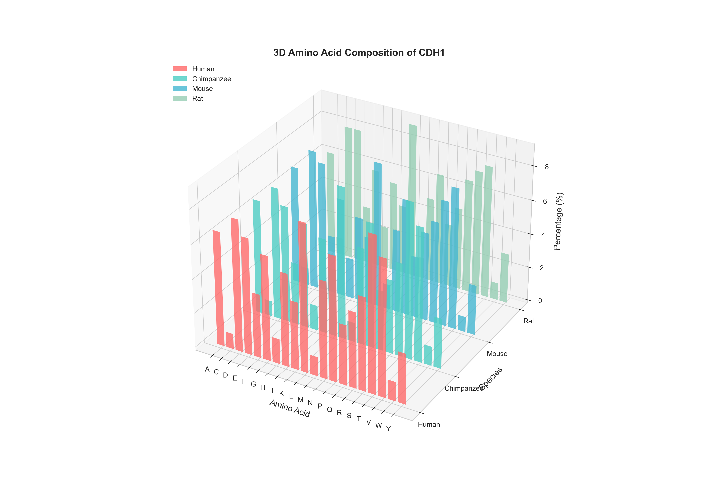

#### 📈 التحليل الرئيسي للمكونات (PCA)
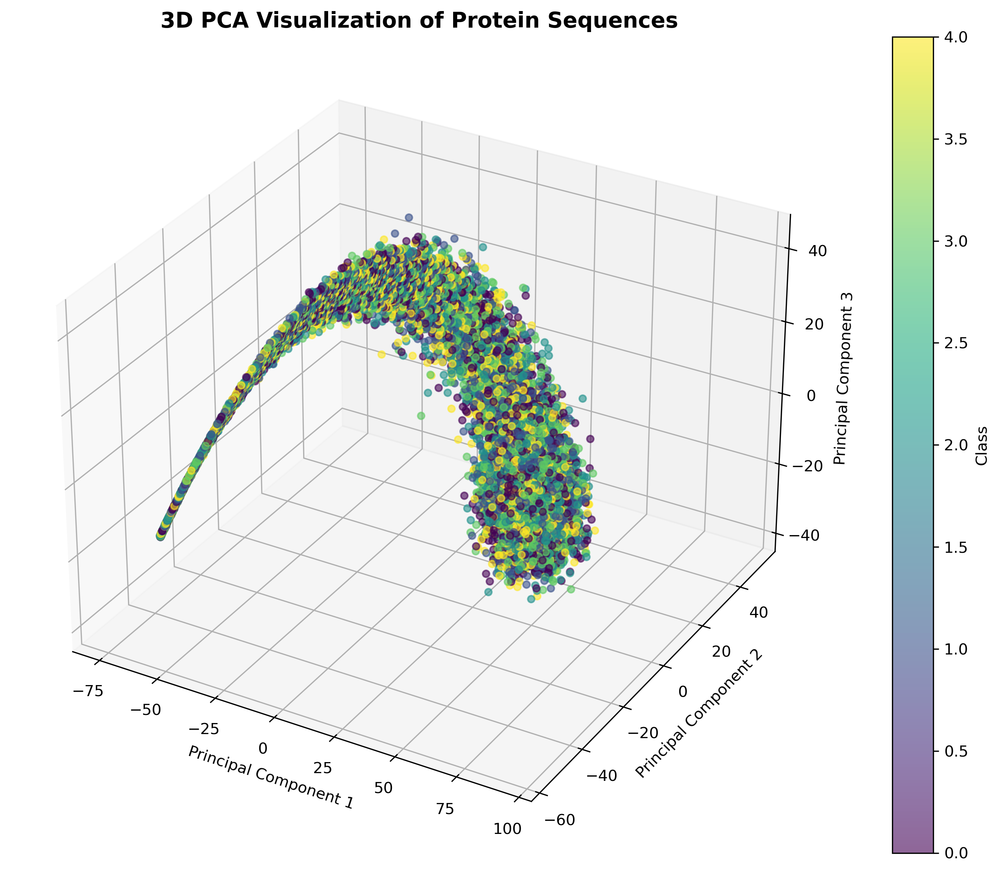
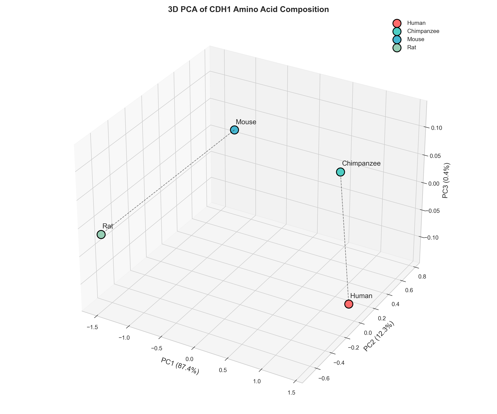

### 🤖 **نتائج الذكاء الاصطناعي**

#### 📈 منحنيات التدريب
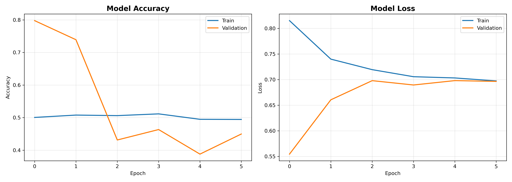

#### 🎯 مصفوفة الخلط (Confusion Matrix)
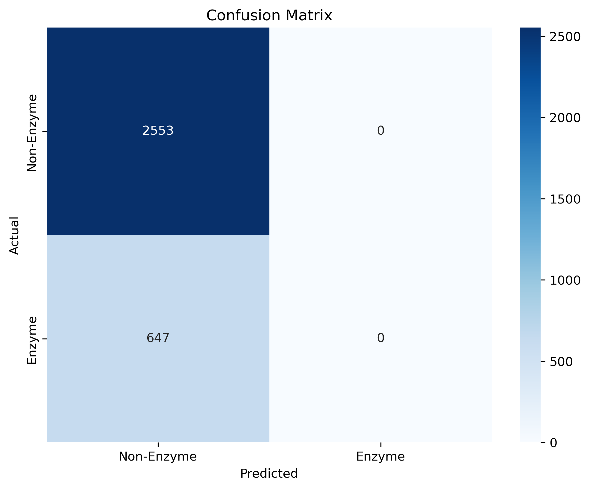

#### 📊 توزيع الفئات
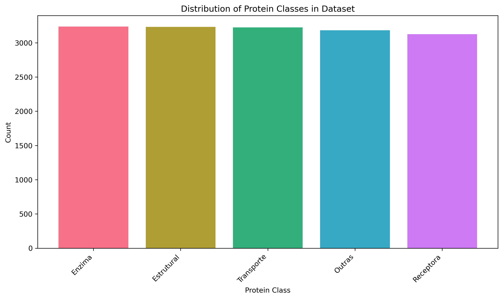

### 📋 **لوحة التحكم الشاملة**


</details>

---

## 🚀 ابدأ الآن!

```bash
# نسخ المشروع
git clone https://github.com/khalilalkhwolani/cdh1-mutation-analysis.git

# الدخول للمجلد
cd cdh1-mutation-analysis

# التثبيت والتشغيل
pip install -r requirements.txt
python scripts/quick_start.py

# 🎉 مبروك! أول تحليل لك جاهز
```

---

<div align="center">

**⭐ إذا أعجبك المشروع، لا تنس تعطيه نجمة على GitHub! ⭐**

**صُنع بـ ❤️ لخدمة المجتمع العلمي**

</div>